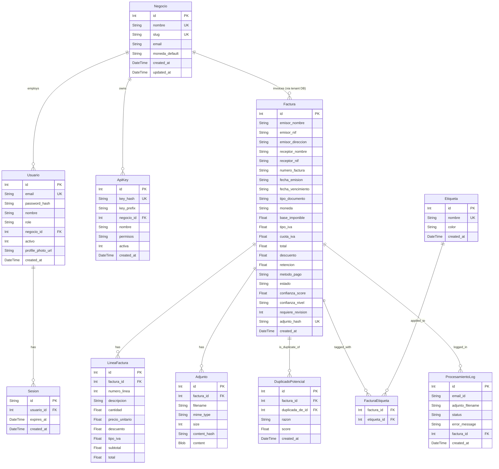

# Data Model Documentation

This document describes the data model for the Facturas multi-tenant invoice management system, including entity descriptions, field definitions, relationships, and an entity-relationship diagram.

## Architecture Overview

The system uses a **multi-tenant architecture** with two database layers:

- **Main Database** (`data/main.db`): Shared across all tenants. Contains negocios (businesses), usuarios (users), sessions, and API keys.
- **Tenant Databases** (`data/negocios/{slug}/facturas.db`): One per negocio. Contains facturas, lineas, adjuntos, etiquetas, duplicados, and processing logs.

## Main Database Entities

### 1. Negocio (Business)

Represents a business tenant in the system. Each negocio has its own isolated database.

**Fields:**
- `id`: Unique identifier (Primary Key, auto-increment)
- `nombre`: Business name (unique, max changes once every 6 months)
- `slug`: URL-safe identifier derived from nombre (unique, auto-generated)
- `email`: Business email (optional, max changes once every 6 months)
- `moneda_default`: Default currency code (default: "MXN")
- `nombre_changed_at`: Timestamp of last nombre change (nullable)
- `email_changed_at`: Timestamp of last email change (nullable)
- `created_at`: Creation timestamp
- `updated_at`: Last update timestamp

**Constraints:**
- Nombre changes limited to once every 6 months
- Email changes limited to once every 6 months
- Slug is auto-generated from nombre and must be unique

**Relationships:**
- `usuarios`: One-to-many with Usuario model
- `api_keys`: One-to-many with ApiKey model

### 2. Usuario (User)

Represents a system user with role-based access.

**Fields:**
- `id`: Unique identifier (Primary Key, auto-increment)
- `email`: User email (unique, required)
- `password_hash`: Bcrypt password hash (required)
- `nombre`: User's display name (required)
- `role`: User role - "admin" or "negocio" (default: "negocio")
- `negocio_id`: Associated negocio ID (nullable, NULL for admin users)
- `activo`: Active flag (default: 1)
- `profile_photo_url`: Profile photo URL (nullable)
- `email_changed_at`: Timestamp of last email change (nullable)
- `created_at`: Creation timestamp
- `updated_at`: Last update timestamp

**Validation Rules:**
- Email is required and must be unique
- Password is bcrypt-hashed (12 rounds)
- Role must be "admin" or "negocio"
- Admin users have negocio_id = NULL
- Business users must have a valid negocio_id

**Relationships:**
- `negocio`: Many-to-one with Negocio model
- `sesiones`: One-to-many with Sesion model

### 3. Sesion (Session)

Represents an active user session.

**Fields:**
- `id`: Session token (Primary Key, crypto random hex, 32 bytes)
- `usuario_id`: Associated user ID (required)
- `expires_at`: Session expiry timestamp (required)
- `created_at`: Creation timestamp

**Constraints:**
- Session ID is generated via `crypto.randomBytes(32).toString("hex")`
- Sessions expire after 30 days
- Cascade delete when user is deleted

**Relationships:**
- `usuario`: Many-to-one with Usuario model

### 4. ApiKey

Represents API keys for public API access.

**Fields:**
- `id`: Unique identifier (Primary Key, auto-increment)
- `key_hash`: Hashed API key (unique, required)
- `key_prefix`: First 8 characters for identification (required)
- `negocio_id`: Associated negocio (required)
- `nombre`: Key name/label (required)
- `permisos`: Permission level - "read" or "read,write" (default: "read")
- `activa`: Active flag (default: 1)
- `ultimo_uso`: Last usage timestamp (nullable)
- `created_at`: Creation timestamp

**Constraints:**
- Key hash is unique
- Cascade delete when negocio is deleted

**Relationships:**
- `negocio`: Many-to-one with Negocio model

---

## Tenant Database Entities

### 5. Factura (Invoice)

Represents an extracted invoice. Core entity of the system.

**Fields:**
- `id`: Unique identifier (Primary Key, auto-increment)

**Emisor (Issuer) fields:**
- `emisor_nombre`: Issuer name (required)
- `emisor_nif`: Issuer tax ID (nullable)
- `emisor_direccion`: Issuer address (nullable)
- `emisor_poblacion`: Issuer city (nullable)
- `emisor_provincia`: Issuer province (nullable)
- `emisor_cp`: Issuer postal code (nullable)
- `emisor_pais`: Issuer country (default: "ES")
- `emisor_email`: Issuer email (nullable)
- `emisor_telefono`: Issuer phone (nullable)
- `emisor_logo`: Issuer logo URL (nullable)

**Receptor (Recipient) fields:**
- `receptor_nombre`: Recipient name (nullable)
- `receptor_nif`: Recipient tax ID (nullable)
- `receptor_direccion`: Recipient address (nullable)
- `receptor_poblacion`: Recipient city (nullable)
- `receptor_provincia`: Recipient province (nullable)
- `receptor_cp`: Recipient postal code (nullable)
- `receptor_pais`: Recipient country (default: "ES")
- `receptor_email`: Recipient email (nullable)

**Invoice data fields:**
- `numero_factura`: Invoice number (required)
- `fecha_emision`: Issue date (required)
- `fecha_vencimiento`: Due date (nullable)
- `tipo_documento`: Document type (default: "factura")
- `moneda`: Currency code (default: "MXN")

**Financial fields:**
- `base_imponible`: Tax base amount (required)
- `tipo_iva`: VAT rate percentage (default: 21.0)
- `cuota_iva`: VAT amount (required)
- `total`: Total amount (required)
- `descuento`: Discount amount (default: 0)
- `retencion`: Withholding tax amount (default: 0)
- `neto`: Net amount (nullable)

**Payment fields:**
- `metodo_pago`: Payment method (nullable)
- `estado`: Invoice status - "pendiente" | "pagada" | "cancelada" (default: "pendiente")

**Email metadata fields:**
- `email_id`: Gmail message ID (nullable)
- `email_asunto`: Email subject (nullable)
- `email_emisor`: Email sender (nullable)
- `email_fecha`: Email date (nullable)

**Attachment metadata fields:**
- `adjunto_nombre`: Original filename (nullable)
- `adjunto_tipo`: MIME type (nullable)
- `adjunto_hash`: SHA-256 content hash (unique, nullable)

**Confidence/Review fields:**
- `confianza_score`: Confidence score 0.0 to 1.0 (default: 1.0)
- `confianza_nivel`: Confidence level - "alta" | "media" | "baja" | "error" (default: "alta")
- `requiere_revision`: Needs manual review flag - 0 or 1 (default: 0)
- `revision_notas`: Review notes (nullable)
- `revision_by`: Reviewer user ID (nullable)
- `revision_at`: Review timestamp (nullable)

**Timestamps:**
- `created_at`: Creation timestamp
- `updated_at`: Last update timestamp

**Validation Rules:**
- emisor_nombre, numero_factura, fecha_emision are required
- base_imponible, cuota_iva, total must be positive numbers
- adjunto_hash must be unique per tenant
- estado must be one of: pendiente, pagada, cancelada
- confianza_score must be between 0.0 and 1.0

**Indexes:**
- `idx_facturas_emisor_nif` on emisor_nif
- `idx_facturas_fecha_emision` on fecha_emision
- `idx_facturas_numero` on numero_factura
- `idx_facturas_adjunto_hash` on adjunto_hash
- `idx_facturas_estado` on estado

**Relationships:**
- `lineas`: One-to-many with LineaFactura model
- `adjuntos`: One-to-many with Adjunto model
- `duplicados`: One-to-many with DuplicadoPotencial model (as factura_id)
- `duplicada_de`: One-to-many with DuplicadoPotencial model (as duplicada_de_id)
- `etiquetas`: Many-to-many with Etiqueta model via FacturaEtiqueta

### 6. LineaFactura (Invoice Line Item)

Represents a line item within an invoice.

**Fields:**
- `id`: Unique identifier (Primary Key, auto-increment)
- `factura_id`: Associated invoice ID (required, Foreign Key)
- `numero_linea`: Line number within the invoice (required)
- `descripcion`: Item description (required)
- `cantidad`: Quantity (default: 1)
- `precio_unitario`: Unit price (required)
- `descuento`: Line discount (default: 0)
- `tipo_iva`: VAT rate for this line (default: 21.0)
- `subtotal`: Subtotal for this line (required)
- `total`: Total for this line (required)

**Constraints:**
- Cascade delete when parent factura is deleted
- Index on factura_id for efficient queries

**Relationships:**
- `factura`: Many-to-one with Factura model

### 7. Adjunto (Attachment)

Represents an uploaded invoice file attachment.

**Fields:**
- `id`: Unique identifier (Primary Key, auto-increment)
- `factura_id`: Associated invoice ID (required, Foreign Key)
- `filename`: Original filename (required)
- `mime_type`: MIME type (nullable)
- `size`: File size in bytes (nullable)
- `attachment_id`: Gmail attachment ID (nullable)
- `content_hash`: SHA-256 content hash (nullable)
- `content`: Raw file content as BLOB (nullable)

**Constraints:**
- Cascade delete when parent factura is deleted
- Index on factura_id

**Relationships:**
- `factura`: Many-to-one with Factura model

### 8. DuplicadoPotencial (Potential Duplicate)

Represents a detected potential duplicate between two invoices.

**Fields:**
- `id`: Unique identifier (Primary Key, auto-increment)
- `factura_id`: The new invoice that might be a duplicate (required, Foreign Key)
- `duplicada_de_id`: The original invoice it might duplicate (required, Foreign Key)
- `razon`: Detection reason - "mismo_numero" | "mismo_monto_fecha" | "hash_exacto" (required)
- `score`: Confidence score 0.0 to 1.0 (required)
- `created_at`: Detection timestamp

**Constraints:**
- Cascade delete on both foreign keys
- Indexes on both factura_id and duplicada_de_id

**Relationships:**
- `factura`: Many-to-one with Factura model (the duplicate)
- `duplicada_de`: Many-to-one with Factura model (the original)

### 9. Etiqueta (Tag)

Represents a tag/label for categorizing invoices.

**Fields:**
- `id`: Unique identifier (Primary Key, auto-increment)
- `nombre`: Tag name (unique, required)
- `color`: Hex color code (default: "#6b7280")
- `created_at`: Creation timestamp

**Constraints:**
- Nombre must be unique within the tenant

**Relationships:**
- `facturas`: Many-to-many with Factura model via FacturaEtiqueta

### 10. FacturaEtiqueta (Invoice-Tag Junction)

Junction table for the many-to-many relationship between facturas and etiquetas.

**Fields:**
- `factura_id`: Invoice ID (composite Primary Key, Foreign Key)
- `etiqueta_id`: Tag ID (composite Primary Key, Foreign Key)

**Constraints:**
- Composite primary key on (factura_id, etiqueta_id)
- Cascade delete on both foreign keys

### 11. ProcesamientoLog (Processing Log)

Logs the result of email attachment processing.

**Fields:**
- `id`: Unique identifier (Primary Key, auto-increment)
- `email_id`: Gmail message ID (required)
- `adjunto_filename`: Original filename (required)
- `status`: Processing status - "pending" | "success" | "error" (default: "pending")
- `error_message`: Error details (nullable)
- `factura_id`: Created factura ID (nullable, Foreign Key)
- `created_at`: Processing timestamp

**Constraints:**
- SET NULL on factura_id delete

**Relationships:**
- `factura`: Many-to-one with Factura model (optional)

---

## Entity Relationship Diagram

## Key Design Principles

1. **Multi-Tenant Isolation**: Each negocio has its own SQLite database file, ensuring complete data isolation between businesses.

2. **Confidence Scoring**: Every extracted invoice gets a confidence score (0.0-1.0) based on data completeness and mathematical consistency. XML sources start at 1.0, PDF at 0.85.

3. **Duplicate Detection**: Automatic detection of potential duplicates based on invoice number + NIF, total + date + NIF, or content hash.

4. **Audit Trail**: Processing logs track every extraction attempt with status and error details.

5. **Currency Conversion**: All monetary values can be converted to the negocio's default currency for unified reporting.

6. **FTS5 Search**: Full-text search indexed on key invoice fields for fast text queries within each tenant.

## Notes

- All `id` fields use SQLite auto-increment
- Timestamps use SQLite's `datetime('now')` function
- Boolean fields use INTEGER (0/1) as SQLite doesn't have a native boolean type
- Content hashes (adjunto_hash) prevent duplicate processing of the same file
- The schema uses `ALTER TABLE ... ADD COLUMN` with existence checks for safe migrations
- FTS5 virtual table with triggers keeps the search index synchronized automatically
